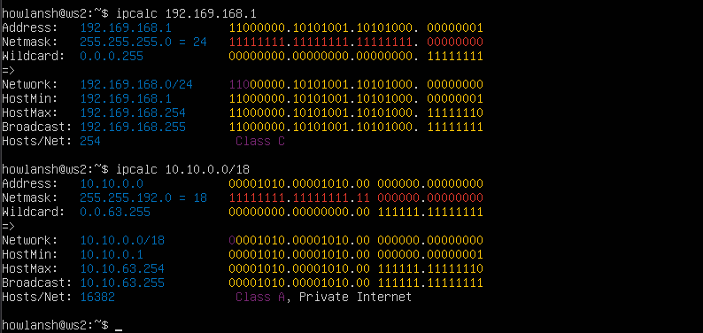
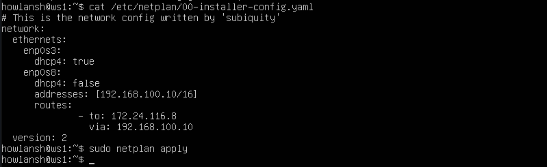
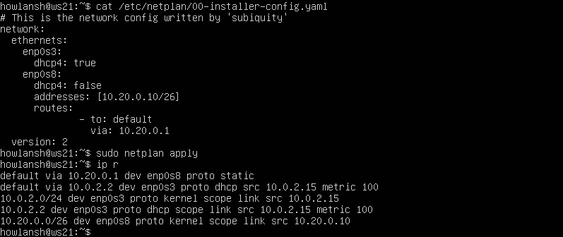
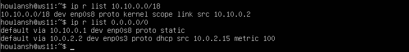
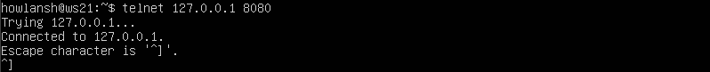

## Part 1. Инструмент ipcalc
* Адрес сети 192.167.38.54/13: 192.160.0.0.
* Перевод маски 255.255.255.0 в префиксную и двоичную запись: /24, 11111111.11111111.11111111.00000000.
* Перевод маски /15 в обычную и двоичную: 255.254.0.0, 11111111.11111110.00000000.00000000.
* 
* Перевод маски 11111111.11111111.11111111.11110000 в обычную и префиксную: 255,255,255,240, /28.
* Минимальный и максимальный хост в сети 12.167.38.4
* При маске /8: 12.0.0.1 - 12.255.255.254.
* При маске /16: 12.167.0.1 - 12.167.255.254.
* 
* При маске 255.255.254.0: 12.167.38.1 - 12.167.39.254.
* При маске /4: 0.0.0.1 - 15.255.255.254.
* 
* Можно ли обратиться к приложению, работающему на localhost, со следующими IP:
* 194.34.23.100 - нельзя.
* 127.0.0.2 - можно.
* 127.1.0.1 - можно.
* 
* 128.0.0.1 - нельзя.
* 
* Какие из перечисленных IP можно использовать в качестве публичного, а какие только в качестве частных:
* 10.0.0.45 - частный.
* 134.43.0.2 - публичный.
* 192.168.4.2 - частный.
* 
* 172.20.250.4 - частный.
* 172.0.2.1 - публичный.
* 192.172.0.1 - публичный.
* 
* 172.68.0.2 - публичный.
* 172.16.255.255 - частный.
* 10.10.10.10 - частный.
* 
* 192.169.168.1 - публичный.
* Какие из перечисленных IP адресов шлюза возможны у сети 10.10.0.0/18:
* 10.0.0.1 - невозможен.
* 10.10.0.2 - возможен.
* 10.10.10.10 - возможен.
* 10.10.100.1 - невозможен.
* 10.10.1.255 - возможен.
* 
## Part 2. Статическая маршрутизация между двумя машинами
* В настройках делаем общую сеть на виртуальных машинах.
* 
* С помощью команды "ip a" смотрим существующие сетевые интерфейсы.
* На ws1:
* 
* На ws2:
* 
* Изменённый файл etc/netplan/00-installer-config.yaml для ws1 и команда "netplan apply" для перезапуска сервиса сети.
* 
* Изменённый файл etc/netplan/00-installer-config.yaml для ws2 и команда "netplan apply".
* 
* Добавляем статический маршрут от одной машины до другой на ws1 при помощи команды "ip r add <IP> dev <DevName>" и пингуем соединение.
* 
* Одновременно добавляем статический маршрут обратно на ws2 и пингуем.
* 
* Добавляем статический маршрут на ws1 от одной машины до другой с помощью файла etc/netplan/00-installer-config.yaml и пингуем.
* 
* Аналогично на ws2.
* 
## Part 3. Утилита iperf3
* 8 Mbps = 1 MB/s.
* 100 MB/s = 800000 Kbps.
* 1 Gbps = 1000 Mbps.
* Для доступа во внешнюю сеть добавляем ещё один адаптер в настройках виртуальной машины.
* 
* Адаптер внутренней сети остаётся без изменений.
* 
* Переписываем настройки в файле etc/netplan/00-installer-config.yaml для ws1, возвращая стандартный настройки для внешней сети и прописываем настройки внутренней сети на новый адаптер.
* 
* Аналогично в файле etc/netplan/00-installer-config.yaml для ws2.
* 
* Выполняем команду "iperf3 -s -f K" на ws1, тем самым запускаем ожидание запроса от другого компьютера.
* Флаг -f используется, чтобы указать формат (k, m, g для Кбит, Мбит, Гбит или K, M, G для Кбайт, Мбайт, Гбайт) для отчета.
* 
* На ws2 выполняем "iperf3 -c <IPRemoteComp> -f K" для отправки запроса по IP адрессу и наблюдаем замер скорости.
* 
## Part 4. Сетевой экран
* Чтобы открыть порт для входящего трафика, используем команду: "iptables -A INPUT -p tcp --dport 80 -j ACCEPT".
* Флаг "-A" означает добавить правило, "-p" указывает на протокол (в данном случае TCP), "--dport" указывает на порт, а "-j" указывает, что делать с пакетами.
* 
* iptables проверяет первое подходящее правило, а значит второе (противоположное) правило уже выполняться не будет.
* 
* Таким образом видим, что с ws1 ping проходит.
* 
* Но с ws2 она не пингуется, хотя через nmap видно состояние "open".
* 
## Part 5. Статическая маршрутизация сети
* Изачально в настройках виртуальных машин настраиваем адаптеры: по 2 внутренних на r1, r2 и по 1 - на ws11, ws21, ws22. В итоге у нас получается три внутренних сети: intnet1, intnet2, intnet3. К сетям intnet1 и intnet3 подключаются виртуальные машины, а через сеть intnet2 роутеры соединяются между собой.
* 
* Прописали настройки в файле etc/netplan/00-installer-config.yaml и проверили для каждой виртуальной машины.
* r1:
* 
* r2:
* 
* ws11:
* 
* ws22:
* 
* ws21:
* 
* Пропинговали ws22 с ws21.
* 
* Пропинговали r1 с ws11.
* 
* Включаем переадресацию IP адресов командой "sysctl -w net.ipv4.ip_forward=1" на роутерах, так она включается до перезагрузки.
* На r1:
* 
* На r2:
* 
* Откроем файл /etc/sysctl.conf и раскомментим строку "net.ipv4.ip_forward = 1". Так переадресация включится на постоянной основе.
* r1:
* 
* r2:
* 
* Настраиваем маршрут по-умолчанию (шлюз) для рабочих станций. Для этого добавляем "default" перед IP роутера в файле конфигураций. Проверяем командой "ip r".
* На ws11:
* 
* На ws22:
* 
* На ws21:
* 
* На r2 выполняем "tcpdump -tn -i enp0s8", команда слушает интерфейс enp0s8 и показывает, что пинг проходит.
* 
* На ws11 пакеты отправляются, но ответ не приходит.
* 
* Прописываем маршрутизацию в r1 (обязательно указывать маску сети, иначе работать не будет):
* 
* В r2:
* 
* Маршрут по умолчанию имеет более низкий приоритет и срабатывает, когда не найден подходящий маршрут в таблице маршрутизации.
* 
* Выполняем на ws11 команду "traceroute 10.20.0.10".
* 
* "tcpdump -tnv -i enp0s8".
* 
* Для определения промежуточных маршрутизаторов traceroute отправляет целевому узлу серию ICMP-пакетов (по умолчанию 3 пакета), с каждым шагом увеличивая значение поля TTL («время жизни») на 1. Это поле обычно указывает максимальное количество маршрутизаторов, которое может быть пройдено пакетом. Первый же маршрутизатор возвращает обратно ICMP-сообщение «time exceeded in transit», указывающее на невозможность доставки данных. Traceroute фиксирует адрес маршрутизатора, а также время между отправкой пакета и получением ответа (эти сведения выводятся на монитор компьютера). Затем traceroute повторяет отправку серии пакетов, но уже с TTL, равным 2, что заставляет первый маршрутизатор уменьшить TTL пакетов на единицу и направить их ко второму маршрутизатору. Второй маршрутизатор, получив пакеты с TTL=1, так же возвращает «time exceeded in transit». Процесс повторяется до тех пор, пока пакет не достигнет целевого узла. При получении ответа от этого узла процесс трассировки считается завершённым.
* Отправляем пинг на несуществующий хост.
* 
* Запускаем "tcpdump -n -i eth0 icmp" и смотрим проходящие через r1 запросы. Видим echo request от ws11.
* 
## Part 6. Динамическая настройка IP с помощью DHCP
* На r1 в файле /etc/dhcp/dhcpd.conf настраиваем конфигурацию службы DHCP:
* 
* В файле resolv.conf прописываем nameserver 8.8.8.8.
* 
* Перезагружаем службу DHCP командой "systemctl restart isc-dhcp-server".
* 
* В сетевом конфиге на ws21 включаем получение IP через DHCP. Делаем рестарт командой "reboot".
* 
* Выполняем команду "ip a" и видим новый IP адресс. Пингуем ws22.
* 
* Изменяем конфигурацию сети на ws11.
* 
* На r1 делаем привязку к MAC адрессу.
* 
* Прописываем DNS сервер.
* 
* Проверяем пингом хостов.
* 
* Запросим на ws21 обновление ip адреса командами "dhclient -r enp0s8" и "dhclient enp0s8".
* 
## Part 7. NAT
* В файле "/etc/apache2/ports.conf" изменяем строку Listen 80 на Listen 0.0.0.0:80, то есть делаем сервер Apache2 общедоступным. Запускаем веб-сервер Apache командой "service apache2 start".
* На r1:
* 
* На ws22:
* 
* Добавляем в файерволл на r2 следующие правила:
* Удаление правил в таблице filter - "iptables -F".
* Удаление правил в таблице "NAT" - "iptables -F -t nat".
* Отбрасывать все маршрутизируемые пакеты - "iptables --policy FORWARD DROP".
* 
* Проверяем соединение между ws22 и r1 командой "ping".
* 
* При запуске с этими правилами, ws22 не пингуется с r1.
* 
* Добавляем ещё одно правило и разрешаем маршрутизацию всех пакетов протокола ICMP.
* 
* При запуске с этими правилами, ws22 пингуется с r1.
* 
* Добавляем ещё два правила:
* Включаем SNAT, а именно маскирование всех локальных ip из локальной сети, находящейся за r2.
* Включаем DNAT на 8080 порт машины r2 и добавляем к веб-серверу Apache, запущенному на ws22, доступ извне сети.
* 
* Проверяем соединение по TCP для SNAT, для этого с ws22 подключиться к серверу Apache на r1 командой "telnet [адрес] [порт]".
* 
* Проверяем соединение по TCP для DNAT, для этого с r1 подключиться к серверу Apache на ws22 командой "telnet"..
* 
## Part 8. Допополнительно. Знакомство с SSH Tunnel
* Запускаем веб-сервер Apache на ws22 только на localhost.
* 
* Воспользуемся Local TCP forwarding с ws21 до ws22, чтобы получить доступ к веб-серверу на ws22 с ws21. Команда "ssh -L 8080:10.20.0.20:80 howlansh@localhost".
* 
* Для проверки выполним команду "telnet 127.0.0.1 [локальный порт]".
* 
* Воспользуемся Remote TCP forwarding c ws11 до ws22, чтобы получить доступ к веб-серверу на ws22 с ws11. Команда "ssh -R 8080:10.20.0.20:80 howlansh@localhost".
* 
* Проверка той же командой.
* 